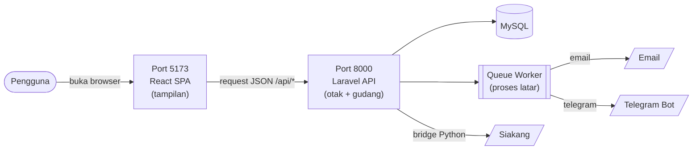
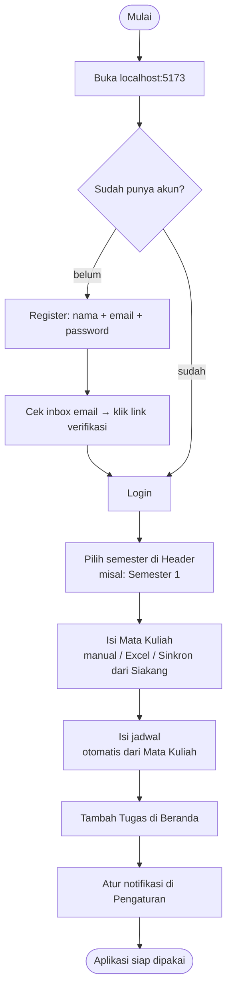
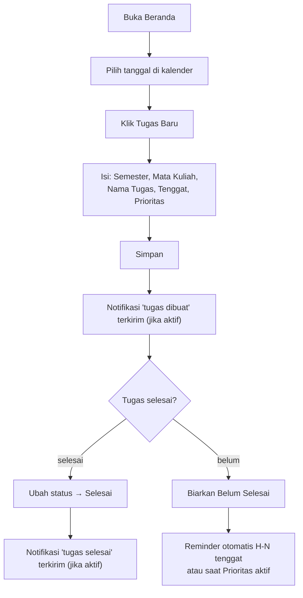
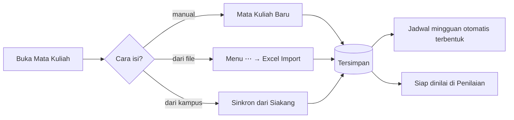
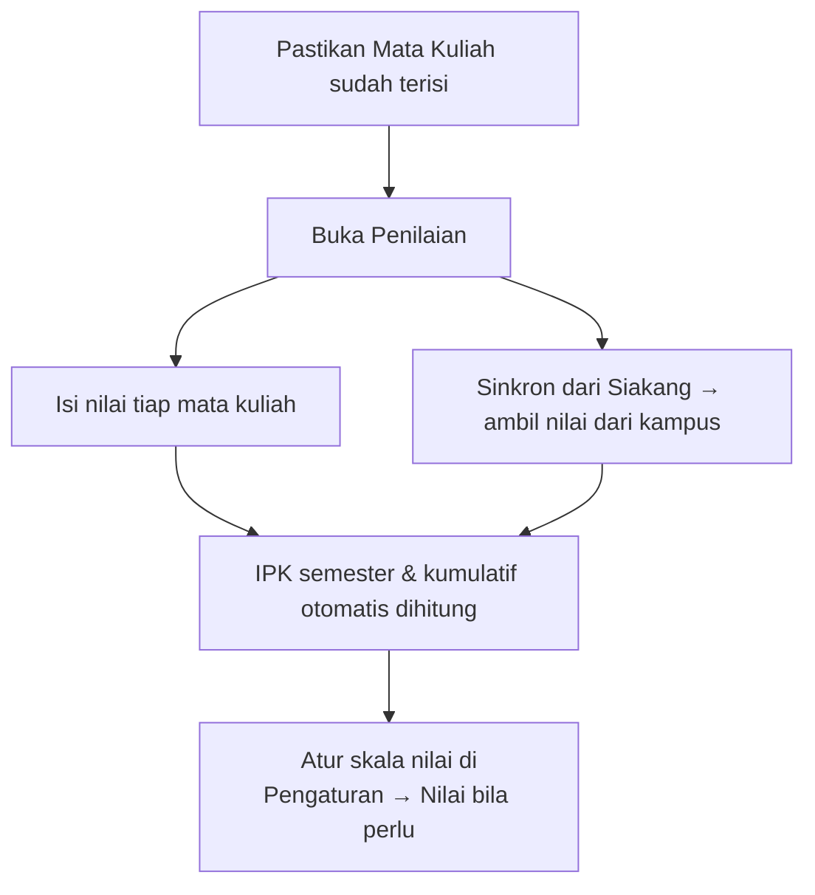
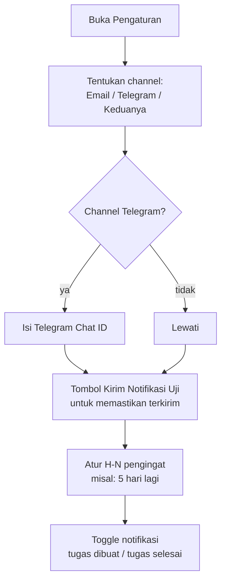
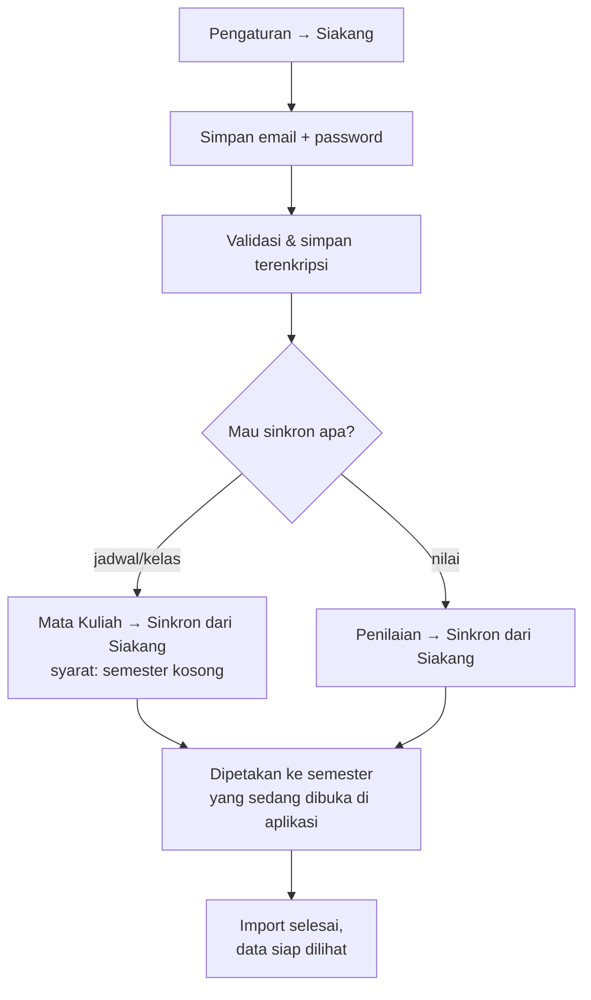

# Alur Sistem & Panduan Pengguna — Task Reminder

Dokumen ini menjelaskan **untuk apa aplikasi ini**, **bagaimana sistem berjalan**, dan **urutan pemakaian yang benar** agar pengguna baru tidak bingung.

> **Bahasa:** seluruh antarmuka, pesan notifikasi (email/Telegram), dan pesan dari API memakai **Bahasa Indonesia**. Tanggal dan nama hari juga ditampilkan dalam format Indonesia.

---

## 1. Aplikasi ini untuk apa?

Task Reminder adalah **aplikasi pengingat tugas kuliah**. Tujuan utamanya: mahasiswa tidak lagi lupa deadline tugas, dan bisa memantau nilai/IPK sekaligus.

| Kebutuhan mahasiswa | Disediakan oleh fitur |
|---|---|
| "Kapan tenggat tugas ini?" | Beranda → Tugas (kalender + status) |
| "Apa saja jadwal kuliah saya minggu ini?" | Jadwal |
| "Mata kuliah apa saja yang saya ambil?" | Mata Kuliah |
| "Berapa nilai & IPK saya?" | Penilaian + Nilai |
| "Ingatkan saya sebelum tenggat" | Notifikasi Email / Telegram |
| "Masih ada tugas apa yang belum selesai?" | Statistik & Diagram Batang di Beranda |

**Catatan penting:** aplikasi ini **tidak punya role/admin**. Setiap user adalah pengguna biasa dan hanya melihat data miliknya sendiri (`user_id`). Jadi `admin@admin.com` di data contoh hanyalah nama, bukan akun administrator.

---

## 2. Bagaimana sistem berjalan (arsitektur)

Aplikasi terdiri dari dua proses terpisah yang **harus jalan bersamaan**:

- **Port 5173** = etalase. Hanya menampilkan halaman, tidak menyimpan data.
- **Port 8000** = gudang + kasir. Menyimpan data, cek password, kirim notifikasi, ambil data Siakang.
- **Queue worker** = pekerja latar untuk mengirim email/Telegram.

> Pengguna **tidak perlu membuka port 8000 di browser**. Cukup buka `http://localhost:5173`, tetapi port 8000 tidak boleh dimatikan.

---

## 3. Alur pemakaian pertama kali

**Urutan yang disarankan (penting):**

1. **Register → verifikasi email → login.** Tanpa verifikasi, halaman lain akan memantulkan kembali ke halaman verifikasi.
2. **Pilih semester** di bagian header (Semester 1–8). Pilihan ini tersimpan dan dipakai oleh semua halaman.
3. **Isi Mata Kuliah dahulu.** Ini fondasi aplikasi — Tugas, Jadwal, dan Penilaian bergantung pada Mata Kuliah.
4. **Baru tambah Tugas**, karena setiap tugas harus dipilihkan mata kuliahnya.
5. **Atur notifikasi** di Pengaturan (email, Telegram, atau keduanya).

---

## 4. Alur per fitur

### 4.1 Beranda & Tugas

Tab di Beranda:

| Tab | Isi |
|---|---|
| **Daftar Tugas** | Statistik, kalender bulanan, tabel tugas per tanggal |
| **Diagram Batang** | Grafik distribusi tugas |
| **Ringkasan Semester** | Ringkasan per semester |

**Prioritas** = tanda tugas penting. Tugas berprioritas akan ikut dikirim di reminder harian, bahkan jika tenggat-nya masih jauh.

**Klik badge tugas di kalender** untuk membuka detail tugas: nama mata kuliah, semester, tenggat lengkap, status, dan deskripsi. Badge menampilkan nama tugas (bukan hanya kode mata kuliah).

### 4.2 Mata Kuliah

- **Sinkron dari Siakang hanya bisa untuk semester kosong.** Jika sudah ada isinya, gunakan **Bersihkan Semester** dahulu (menghapus Mata Kuliah + Tugas + nilai di semester itu).
- **Bersihkan Semester** bersifat permanen dan tidak bisa dibatalkan.

### 4.3 Jadwal

Menampilkan jadwal kuliah mingguan dari data Mata Kuliah (hari + jam). Tidak ada input di halaman ini — jadwal berasal dari Mata Kuliah, baik manual, Excel, maupun Sinkron dari Siakang.

**Klik blok mata kuliah** (mis. Basic Networking hari Senin) untuk membuka detail: kode, dosen, SKS, jam, dan **daftar seluruh tugas mata kuliah itu** beserta tenggat, status, dan deskripsinya. Jumlah tugas juga tampil di blok jadwal.

### 4.4 Penilaian & Nilai

### 4.5 Pengaturan & Notifikasi

Tab **Pengaturan**:

| Tab | Fungsi |
|---|---|
| **Notifikasi** | Channel (email/Telegram/Keduanya), H-N pengingat, toggle tugas dibuat/selesai, tombol tes |
| **Siakang** | Simpan email & password Siakang (terenkripsi) + tombol tes koneksi |
| **Nilai** | Skala nilai kustom (misal A = 85–100) |
| **Profil** | Ubah nama/email/password. Ganti email → wajib verifikasi ulang |

> **Kirim Notifikasi Uji** bersifat instan (langsung tampil sukses/gagal). Notifikasi biasa masuk antrean, jadi **queue worker harus jalan** (`php artisan queue:listen`).

**Isi pesan Telegram** — reminder tenggat, tugas dibuat, dan tugas selesai semuanya memuat nama mata kuliah, nama tugas, serta **deskripsi tugas** (otomatis dipotong jika terlalu panjang). Deskripsi kosong tidak menampilkan barisnya.

### 4.6 Alur Sinkron Siakang

---

## 5. Peta halaman

| Halaman | URL | Akses |
|---|---|---|
| Login | `/auth/login` | Publik |
| Register | `/auth/register` | Publik |
| Lupa Password | `/auth/forgot-password` | Publik |
| Verifikasi Email | `/auth/verify-email` | Setelah register |
| Beranda | `/dashboard` | Perlu login |
| Mata Kuliah | `/course-contents` | Perlu login |
| Jadwal | `/schedule` | Perlu login |
| Penilaian | `/assessments` | Perlu login |
| Pengaturan | `/settings` | Perlu login |

---

## 6. Jika terjadi masalah

| Gejala | Kemungkinan penyebab | Solusi |
|---|---|---|
| Data tidak muncul / "Network Error" | Port 8000 mati | `cd server && composer run dev` |
| Halaman hanya menampilkan `Menyala abangkuh` | Membuka port 8000, bukan 5173 | Buka `http://localhost:5173` |
| Login gagal, halaman balik ke verifikasi | Email belum diverifikasi | Cek inbox & klik link verifikasi |
| Notifikasi email/Telegram tidak terkirim | Queue worker mati | `cd server && php artisan queue:listen --tries=1` |
| Tombol "Sinkron dari Siakang" mati | Semester belum kosong | Bersihkan Semester dahulu (permanen!) |
| Ingin memastikan reminder berjalan tanpa menunggu | — | `cd server && php artisan notifications:reminder` |

> **Catatan teknis:** perintah `notifications:reminder` saat ini belum terpasang di scheduler (`server/routes/console.php`). Untuk pengiriman otomatis harian, tambahkan penjadwalannya, atau jalankan manual seperti di atas.
